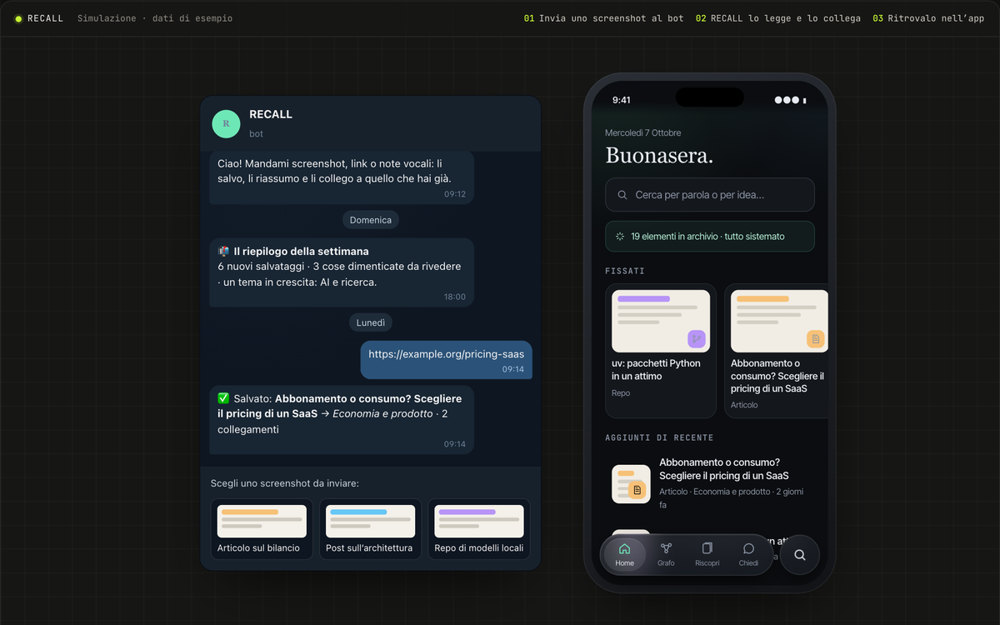

# RECALL

> Salvi uno screenshot in un gesto. RECALL capisce cosa contiene, lo collega al resto e te lo ripropone quando serve.

`04` · **Progetto personale · memoria digitale** · 2026 · Ideazione e sviluppo

[**▶ Prova la demo**](https://portfolio.lele-tradevalue.com/progetti/recall/#demo) · [Caso studio completo](https://portfolio.lele-tradevalue.com/progetti/recall/) · [English version](https://portfolio.lele-tradevalue.com/en/progetti/recall/)

## Il problema

Tutti salviamo cose — repository da provare, articoli, consigli, prodotti — tra screenshot, preferiti e chat con noi stessi. Il difficile non è salvare: è ritrovare. Dopo una settimana quell’idea è sepolta nel rullino.

## Cosa ho costruito

RECALL è un archivio personale che si organizza da solo. Mando uno screenshot o un link al bot Telegram: un modello di visione ne estrae titolo, tipo, entità e argomento, scarta i doppioni e lo collega agli elementi simili. Una web app permette di cercare per parola o per significato, esplorare il grafo dei collegamenti, riscoprire ciò che avevo dimenticato e fare domande all’archivio.

## Come funziona

1. **Cattura** — Uno screenshot al bot, da qualsiasi app. Fine.
2. **Comprensione** — La visione estrae dati strutturati; un’impronta dell’immagine blocca i doppioni.
3. **Collegamenti** — Ogni elemento entra in un grafo con relazioni esplicite: alternativa, approfondisce, prerequisito.
4. **Ricerca ibrida** — Significato e parole chiave lavorano insieme e i risultati vengono fusi.
5. **Riscoperta** — Ogni domenica un riepilogo; ogni giorno un mazzo di cose da tenere o archiviare.

## Perché funziona

- **Un gesto per salvare.** Nessun modulo da compilare: titolo, tipo e argomento arrivano da soli.
- **Trovi per significato.** «Quel tool per i diagrammi» funziona anche se non ricordi il nome.
- **Le cose tornano da sole.** Ricorrenze, elementi dimenticati e collegamenti con ciò che salvi oggi.
- **Chiedi all’archivio.** Risposte in chat che citano gli elementi salvati.

## In numeri

| | |
|---:|---|
| **8** | tipi di contenuto riconosciuti |
| **5** | tipi di relazione nel grafo |
| **2** | motori di ricerca fusi |
| **1** | gesto per salvare |

## Stack

`Python` `FastAPI` `React` `SQLite` `Embeddings` `Telegram`

## Cosa resta privato

L’archivio reale è personale: la demo usa una raccolta di esempio. Questo repository contiene solo la presentazione del progetto: niente codice sorgente, cronologia o configurazioni.

<b>In English</b>

**RECALL** — Save a screenshot in one gesture. RECALL understands what is in it, connects it to everything else and brings it back when you need it.

RECALL is a personal archive that organises itself. I send a screenshot or a link to a Telegram bot: a vision model extracts title, type, entities and topic, drops duplicates and links it to similar items. A web app lets me search by keyword or by meaning, explore the graph of connections, rediscover what I had forgotten and ask the archive questions.

- **One gesture to save.** No forms: title, type and topic fill themselves in.
- **Find by meaning.** “That diagram tool” works even if you forgot its name.
- **Things come back on their own.** Anniversaries, forgotten items and links to what you save today.
- **Ask the archive.** Chat answers that cite the saved items.

[Read the full case study and try the demo →](https://portfolio.lele-tradevalue.com/en/progetti/recall/)

---

Emanuele Montalto · [portfolio](https://portfolio.lele-tradevalue.com) · [LinkedIn](https://www.linkedin.com/in/emanuele-montalto/) · [montalto36@gmail.com](mailto:montalto36@gmail.com)
